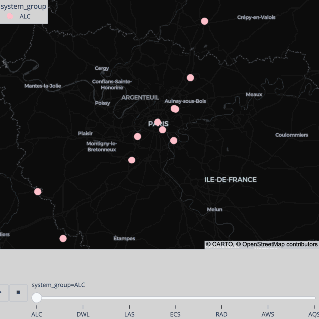

# (urbanair-dm) Observation Examples and Data

Python and Jupyter notebook examples for UrbanAir Observations.

- Doppler lidar, keywords: wind field, turbulence, DWL, Streamline
- Ceilometer lidar, keywords: clouds, mixed layer height, ALC, CL61

## Setup

Set up your own jupyterlab environement, or use the supplied `environment.yml` (or `environment_optional.yml`) file to create the `urbanair312v1` environment:

```bash
mamba create -n urbanair312v1 python="3.12"
mamba env update -n urbanair312v1 -f environment.yml
conda activate urbanair312v1
```

Create a kernelspec for jupyter notebooks, in this case within the new environment:
```bash
conda activate urbanair312v1
python3 -m ipykernel install --user --name="urbanair312v1"
```

## Data

For Paris simulations, the following examples are public:

- `urbanair-dm/analysis/notebooks/streamline_stats_mwe.ipynb` [link](https://github.com/z--m-n/urbanair-dm/blob/main/analysis/notebooks/streamline_stats_mwe.ipynb)
- `urbanair-dm/analysis/notebooks/ceilometer_stats_mwe.ipynb` [link](https://github.com/z--m-n/urbanair-dm/blob/main/analysis/notebooks/ceilometer_stats_mwe.ipynb)

Further instructions are included in these Minimal Working Example notebooks.

Those can be accessed within a browser, for example,
```bash
conda activate urbanair312v1
jupyter notebook urbanair-dm/analysis/notebooks/ceilometer_stats_mwe.ipynb
```

## Metadata
For Paris observations metadata, the examples are currenlty private.

